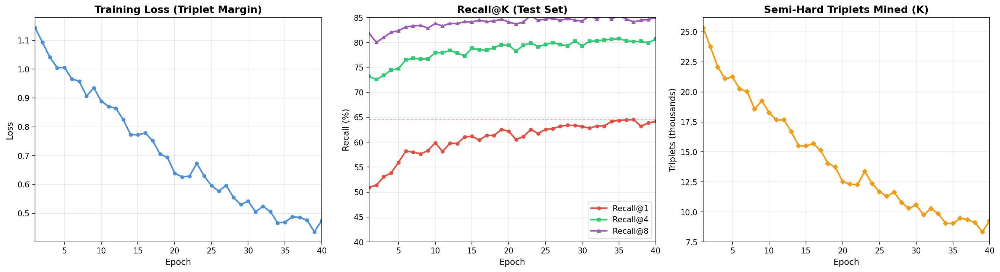
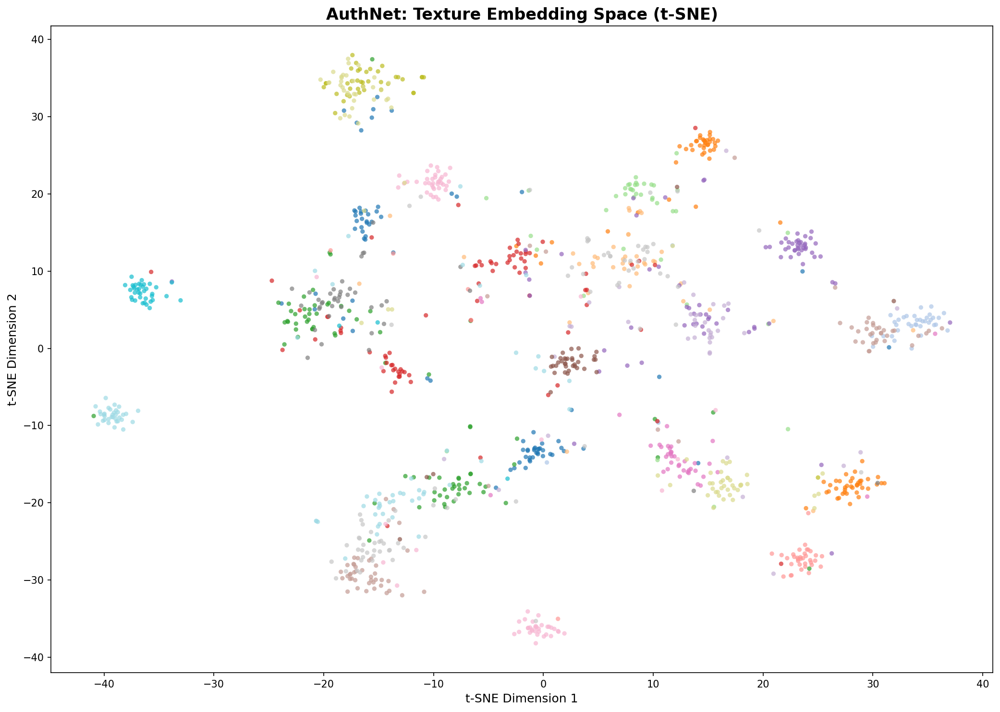
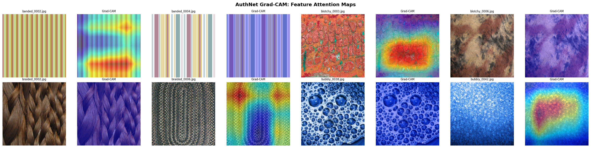
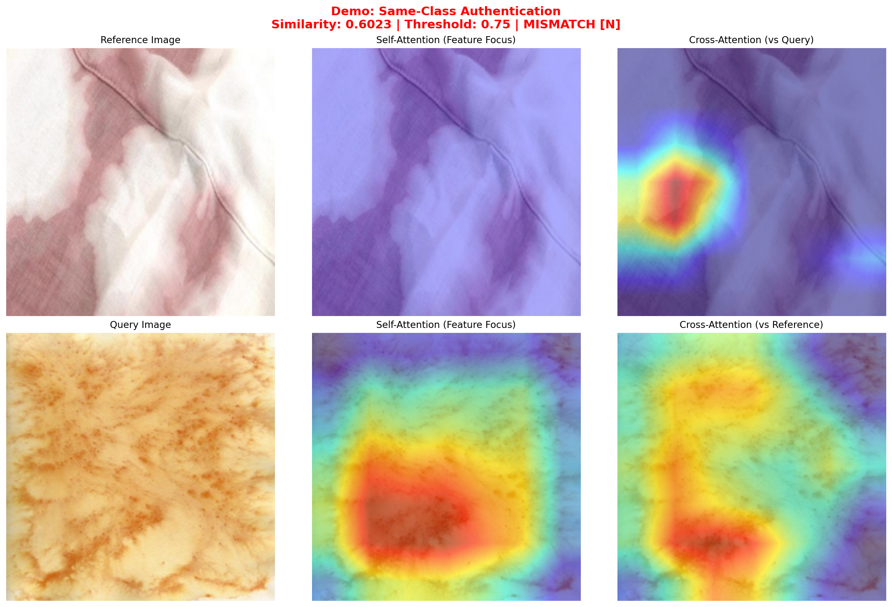

# AuthNet: Texture-Level Product Authentication & Visual Fingerprinting

A deep metric learning system for product authentication and visual fingerprinting using PyTorch. The model analyzes microscopic texture patterns (leather grain, fabric weave, material surfaces) to authenticate products and generate unique visual identities — directly inspired by real-world luxury goods authentication systems like [Entrupy](https://www.entrupy.com/).

## Key Features

- **Product Authentication** — Verify if two items are the same via cosine similarity matching on learned texture embeddings
- **Visual Fingerprinting** — Generate unique 128-dimensional identity vectors from product images
- **Model Interpretability** — Grad-CAM heatmaps showing which texture regions the model focuses on for authentication decisions
- **Edge Deployment Ready** — ONNX export with INT8 Post-Training Quantization (~4x model size reduction)
- **REST API** — FastAPI server with `/authenticate`, `/fingerprint`, `/explain`, and `/health` endpoints
- **Tested** — 26 unit and integration tests for model, data pipeline, and API

---

## Architecture

```
Input Image (3 × 224 × 224)
        │
        ▼
┌─────────────────────┐
│  ResNet-18 Backbone  │  ← ImageNet pre-trained (layer1 frozen)
│  Output: 512-dim     │
└─────────────────────┘
        │
        ▼
┌─────────────────────┐
│  Embedding Head      │
│  FC(512→256) → BN    │
│  → ReLU → Dropout    │
│  → FC(256→128)       │
│  → L2 Normalize      │
└─────────────────────┘
        │
        ▼
  128-dim Unit Embedding
     ("Fingerprint")
```

**Training Pipeline:**
- **Loss**: Multi-Similarity Loss (alpha=2, beta=50) from `pytorch-metric-learning`
- **Mining**: `MultiSimilarityMiner` (epsilon=0.1) — mines all informative positive/negative pairs
- **Sampling**: `MPerClassSampler` (8 samples/class per batch) for balanced training
- **Scheduler**: Cosine Annealing with differential learning rates (backbone: 1e-4, head: 1e-3)

---

## Results

### Retrieval Metrics

| Metric | Value |
|:-------|:------|
| **Recall@1** | **64.52%** |
| **Recall@2** | 73.88% |
| **Recall@4** | 80.16% |
| **Recall@8** | 84.10% |
| **mAP** | 48.97% |
| **NMI** | 0.697 |
| Classes | 47 (DTD textures) |
| Test Samples | 1,880 |

> With 47 classes, random chance Recall@1 would be ~2.1%. Our model achieves **31x improvement over random baseline**.

### Training Curves



Trained for **40 epochs** on an NVIDIA RTX 4050 in ~25 minutes using Multi-Similarity Loss. The decreasing number of mined pairs per epoch confirms the model progressively separates texture classes in embedding space.

### t-SNE Embedding Visualization



t-SNE visualization of the learned 128-dim embedding space (30 of 47 classes shown). Each color represents a different texture class. Clear cluster separation confirms the model learned meaningful texture representations.

---

## Edge Deployment: ONNX + INT8 Quantization

| Runtime | Latency (median) | P95 Latency | Model Size |
|:--------|:-----------------|:------------|:-----------|
| PyTorch GPU (RTX 4050) | **2.40 ms** | 3.27 ms | — |
| PyTorch CPU | 14.78 ms | 16.34 ms | — |
| ONNX FP32 (CPU) | 6.85 ms | 8.13 ms | 43.3 MB |
| **ONNX INT8 (CPU)** | **8.00 ms** | **9.62 ms** | **10.9 MB** |

- **4x model compression** via INT8 Post-Training Quantization with calibration data
- ONNX validation: max absolute difference from PyTorch = **7.45e-08** (effectively lossless)
- 11.3M parameters (ResNet-18 backbone)

---

## Grad-CAM Interpretability

### Feature Attention Maps



Grad-CAM visualization showing which regions the model focuses on for each texture type. Notice how the model attends to discriminative texture patterns — band structures, surface irregularities, weave patterns, and bubble formations.

### Authentication Decision Explanation



Authentication visualization comparing two images with self-attention (what features does the model extract?) and cross-attention (which regions contribute to the similarity score?).

> **Note**: Standard Grad-CAM targets class logits. Since our model outputs embeddings, we implemented a custom `EmbeddingSimilarityTarget` that computes gradients w.r.t. cosine similarity between embeddings — a non-trivial adaptation for metric learning models.

---

## Quick Start

### Installation

```bash
git clone https://github.com/omtilwar/authnet.git
cd authnet
pip install -r requirements.txt
```

### Download Data & Train

```bash
python scripts/download_data.py    # Downloads DTD (47 texture classes)
python -m src.train                # Train with Triplet Loss (~15 min on GPU)
```

### Run Demo

```bash
python scripts/demo.py             # End-to-end: fingerprint → authenticate → Grad-CAM
```

### Export & Benchmark

```bash
python -m src.export               # ONNX export → INT8 quantization → benchmark
```

### Start API Server

```bash
uvicorn api.main:app --reload
```

**Endpoints:**

| Method | Endpoint | Description |
|:-------|:---------|:------------|
| `POST` | `/fingerprint` | Generate 128-dim visual fingerprint |
| `POST` | `/authenticate` | Compare two images (match/mismatch) |
| `POST` | `/explain` | Grad-CAM heatmap for an image |
| `GET` | `/health` | Health check |

### Run Tests

```bash
pytest tests/ -v                   # 26/26 tests passing
```

---

## Project Structure

```
authnet/
├── api/
│   └── main.py                 # FastAPI server (4 endpoints)
├── src/
│   ├── model.py                # EmbeddingNet (ResNet-18 → 128-dim)
│   ├── dataset.py              # TextureDataset + augmentation pipeline
│   ├── train.py                # Training loop + semi-hard mining
│   ├── evaluate.py             # Recall@K, mAP, NMI, t-SNE
│   ├── fingerprint.py          # FingerprintEngine (create + authenticate)
│   ├── interpretability.py     # Grad-CAM with custom embedding targets
│   └── export.py               # ONNX export + INT8 quantization + benchmarks
├── scripts/
│   ├── download_data.py        # Dataset download automation
│   ├── demo.py                 # End-to-end demonstration
│   ├── run_evaluation.py       # Full evaluation pipeline
│   └── plot_training.py        # Training curve visualization
├── tests/
│   ├── test_model.py           # 9 model architecture tests
│   ├── test_dataset.py         # 7 data pipeline tests
│   └── test_api.py             # 10 API endpoint tests
├── config.py                   # Central configuration
├── requirements.txt            # Dependencies
└── README.md
```

---

## Tech Stack

- **PyTorch** — Model architecture and training
- **pytorch-metric-learning** — Triplet loss, miners, and samplers
- **ONNX Runtime** — Model export and INT8 quantization
- **pytorch-grad-cam** — Model interpretability
- **FastAPI** — REST API serving
- **scikit-learn** — t-SNE, NMI, K-Means clustering
- **Describable Textures Dataset (DTD)** — 47 texture classes, 5,640 images

---

## License

MIT
